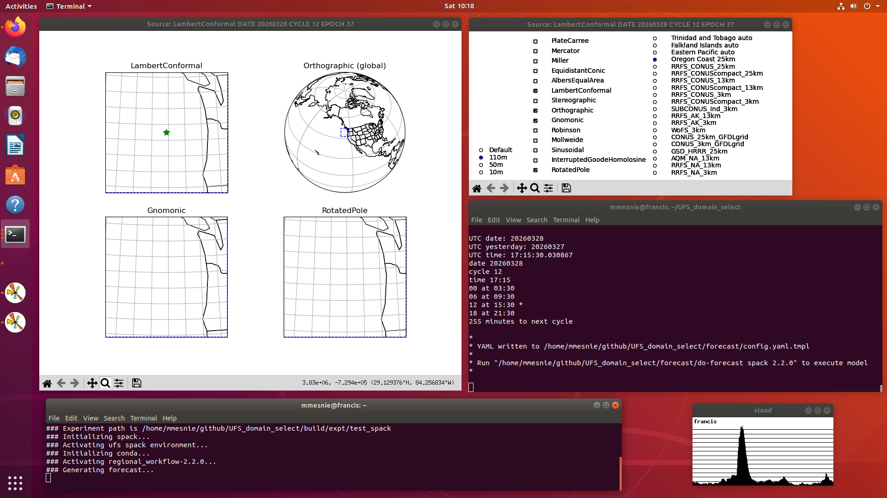

# UFS_domain_select

A Cartopy GUI script to generate the YAML config for a UFS SRW regional forecast.

Scripts to build the stack (spack or hpc) and the UFS SRW model are also included. 
These are useful scripts even if you don't plan to use the GUI. In particular,
the do-all script will build and install everything (spack or hpc stack, ufs, 
anaconda, data files, etc.), generate a forecast, and plot the result. The default
config.yaml is a 6-hour 500 MB FORECAST of the Oregon coast. The do-all script could
take any number of hours to complete, depending on your platform. My slowest system
(a Dell Inspiron with a 3 GhZ dual-core Pentium and 16 GiB of memory, circa 2013) 
takes about 10 hours.

# Building with spack stack

It's best to start with a fresh Ubuntu installation.

Make sure you have sudo access to install the prereqs.

1. cd UFS_domain_select/stack
2. ./do-all spack 3.0.0

# Tested Spack stack platforms (do-all script)

| Distribution | Stack | UFS model | Last tested OK  |
| ---          | ---   | ---       | ---             |
| Ubuntu 24.04 | spack | 3.0.0     | 4/16/26         |
| Ubuntu 24.04 | spack | 2.2.0     | 4/15/26         |
| Ubuntu 22.04 | spack | 3.0.0     | 4/16/26         |
| Ubuntu 22.04 | spack | 2.2.0     | 4/16/26         |
| Ubuntu 20.04 | spack | 3.0.0     | 4/17/26         |
| Ubuntu 20.04 | spack | 2.2.0     | 4/17/26         |
| Ubuntu 18.04 | spack | 3.0.0     | 4/18/26         |
| Ubuntu 18.04 | spack | 2.2.0     | 4/17/26         |

# Building with hpc stack

It's best to start with a fresh Ubuntu installation.

Make sure you have sudo access to install the prereqs.

1. cd UFS_domain_select/stack
2. ./do-all hpc 3.0.0

# Tested HPC stack platforms (do-all script)

| Distribution | Stack | UFS model | Last tested OK  |
| ---          | ---   | ---       | ---             |
| Ubuntu 24.04 | hpc   | 3.0.0     | 4/15/26         |
| Ubuntu 24.04 | hpc   | 2.2.0     | 4/16/26         |
| Ubuntu 22.04 | hpc   | 3.0.0     | 4/17/26         |
| Ubuntu 22.04 | hpc   | 2.2.0     | 4/17/26         |
| Ubuntu 20.04 | hpc   | 3.0.0     | In progress     |
| Ubuntu 20.04 | hpc   | 2.2.0     |                 |
| Ubuntu 18.04 | hpc   | 3.0.0     |                 |
| Ubuntu 18.04 | hpc   | 2.2.0     |                 |

/usr/bin/ld: /home/mmesnie/ufs_domain_select/build/opt-for-2.2.0/gnu-11/openmpi-4.1.2/hdf5/1.10.6/lib/libhdf5.a(H5Zdeflate.o): undefined reference to symbol 'inflateEnd'

# Generating a new forecast with the GUI

1. Run "./UFS_domain_select" to start the GUI.
2. Hover your mouse over the Lambert Conformal or Rotated Pole grid and press 'y'
   to output the YAML template file for the selected region. This will overwrite
   the config.yaml.tmpl file in the forecast directory. The do-forecast script
   will modify this template to create ush/config.yaml in the UFS SRW source tree. 
5. Run "../do-forecast spack 3.0.0" to generate and plot the forecast.

Below is a screengrab of the GUI.  Radio buttons are used to select from one of
the predefined regions (e.g., RRFS_CONUS, SUBCONUS_Ind, Oregon Coast), each of
which can be modified to select a different region.  Radio buttons are also used
to select among the various projections (e.g., Lambert Conformal, Rotated Pole,
Mercator). Hovering the mouse over Lambert Conformal or Rotated Pole and
pressing 'y' will output the YAML config for that region.  From there, you can
generate the forecast.

# If you only want to use the Cartopy GUI 

This applies if you already have your own stack and UFS model and only want to
use the GUI to create a config.yaml file -

Once the GUI starts, follow the on-screen instructions to generate a new config.yaml.tmpl
file (located in the forecast directory). Rename this file to config.yaml, update each 
\<VARIABLE\> in the file as needed to match your platform, and overwrite the file in your
UFS source tree (ush/config.yaml).

